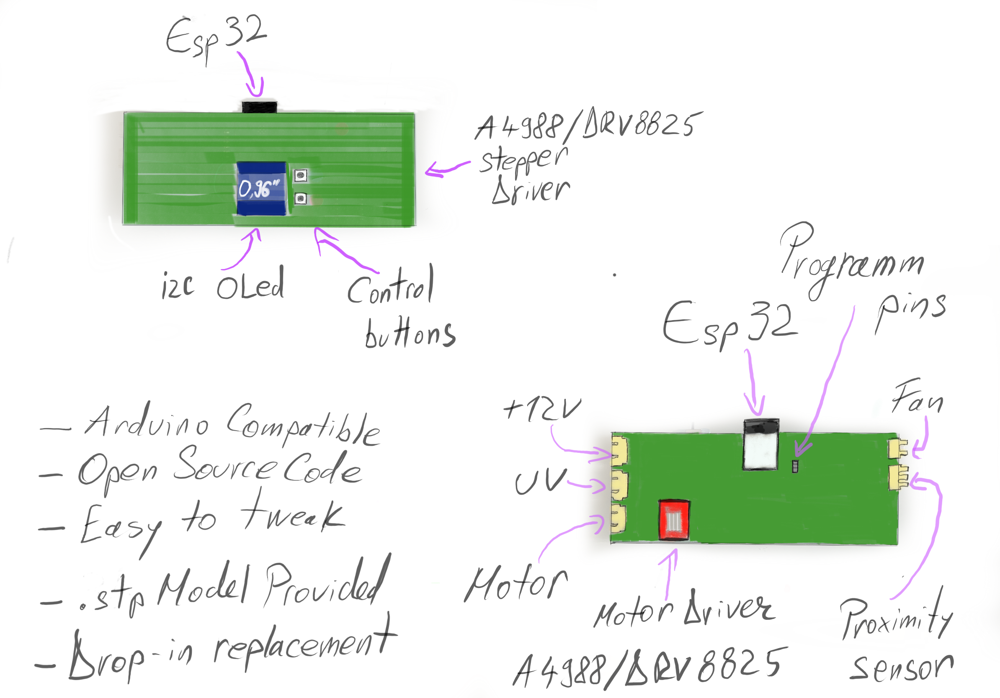

<b>What is this board?</b>

This is a drop in replacement board for the Anycubic Wash and Cure station that is used in conjunction with resin 3D Printers to clean and cure the resin prints after removing them form the printer. 

<b>How did this board came to life ?</b>

For some of my projects I am using resing 3D printing and I have to use the Anycubic Wash and Cure station extensively but something about it was not quite how I needed it and I decided to fix the problem myself. 

<b>My personal issues with the original board : </b>

1. In my workflow, I need to cure the resin for 8 minutes but the original board allows only to set 2 , 4 or 6 minutes. 
2. It always starts when powered up on CURE and not on Washing. I had many times pressed start forgetting I had to switch to wash so I messed a bit my prints. 
3. I have my printing setup in a location outside and not near my desk so I wanted a way to get informed when the curing or washing was done ( I hate to waste time near the printer and hearing the buzzer sound is not possible from ym desk) . 

So not so many issues but using the machine very often these became real issues for my workflow . 

<b>What the new board does : </b>
1. Starts and allows you to decide what you want to do ( wash or cure) and to do that you just need to press the corresponding button for Wash or Cure . 
2. Uses wi-fi to connect to my home network and allows me to configure the time for washing and curing from a nice web interface . 
3. Maintains all the functionality of the original board in terms of safety.
4. Adds and OLED Display that give information about the ongoing process but also about the process of pairing the station to the Wi-fi Network. 
5. Allows any person with the knowledge to imrpove the software and share with the others . 
6. Comes with a basic but fully functional software preladed and tested . 
7. Fully coated in anti corosive material "just in case" .

<b>Why to buy this board ? </b>

Well, that would help me and allow me to keep developing boards like this while improving the board I have already made . 
This board in conjuction with some Arduino knowledge will allow you to tailor the way it works to perfectly fit your workflow just like you can do in FDM printing with the after market boards. 
The software and the pinout of the board is open sourced and you can see all the details you need here in order to play with the software yourself. 
Of course I can not be held responsible if you damage the board while doing this but I can give you some tips like : Make sure the UV and FAN pins are allways pulled low when your program starts or otherwise it will damage the mosfet and you will need to replace it. 

<b> Board specifications :</b>

Controller/ Processor : ESP32 ( Dual core version)

Motor Driver : Stick driver compatible with A4988 or DRV8825 ( Comes with A4988)

Input Power : 12V DC

Screen : 0,96' Monchrome OLED

Configurable buttons : 3 ( 1 acts also a programming mode button) 

Switching for UV and Fan : Thru Mosfets triggered by GPIO Pins

Programming port : 3 pin RS232 @3.3v (RX,TX,GND)

Same ports as the original board from the Wash and Cure .

<b> Needed software and libraries to work with this board : </b>

IDE : Arduino 1.8.3 ( I assume it will work with others like PlatformIO but I have not tested it so I warrant for Arduino IDE on Windows 10 , MacOS Catalina and linux flavours based on Ubuntu 20.04)

Board BSP : ESP32

Libraries : 

-ESPUI
-AccelStepper
-Adafruit SSD 1306
-Adafvruit GFX
-DNSServer ( possibly included in the ESP32 BSP)

<b> Where to buy the board </b>

Tindie Link Here
